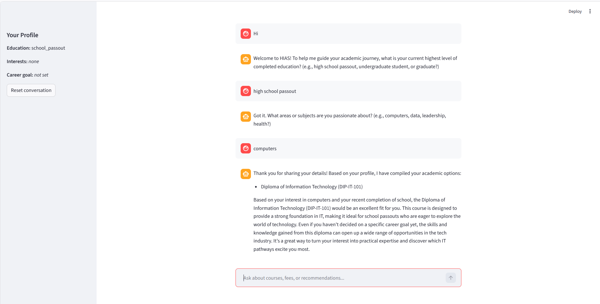

# 🎓 Course Advisor AI

> Conversational course advisor for a fictional Australian institute. Built on Azure OpenAI, ChromaDB and Streamlit. Combines Retrieval-Augmented Generation for policy questions with a profile-driven recommendation engine for course suggestions.



## What this is

A working multi-turn chatbot for **Horizon Institute of Applied Studies (HIAS)** — a fictional Australian institute used as a stand-in for any education provider. It handles two distinct conversation modes from the same chat window:

- **Knowledge mode (RAG).** Answers grounded questions about enrolment, fees, cancellation, refunds, exam failure, extensions and academic progress — using only the institute's policy documents, with source citations.
- **Advisor mode (recommendation).** Profiles the student across three slots — *education level → interests → career goal* — and returns ranked course suggestions with a personalised explanation. Routes school leavers to diplomas, undergraduates to bachelor courses, and graduates to postgraduate options.

Both modes share one stateful dialogue router. A single message can carry both intents (*"I just finished school. What happens if I withdraw after census?"*) and the system handles them correctly.

## Architecture

```
                            ┌─────────────────────────────┐
       Streamlit UI ──────▶ │  Dialogue Router (advisor)  │
       (app.py)             │  • detects intent           │
                            │  • maintains profile state  │
                            │  • handles negation         │
                            └────────────┬────────────────┘
                                         │
                       ┌─────────────────┴─────────────────┐
                       │                                   │
                       ▼                                   ▼
            ┌──────────────────────┐         ┌────────────────────────┐
            │  RAG Engine          │         │  Recommender           │
            │  (chat_engine.py)    │         │  (recommender.py)      │
            │  • policy questions  │         │  • profile → courses   │
            │  • grounded answers  │         │  • LLM explanation     │
            │  • source citations  │         │                        │
            └──────────┬───────────┘         └───────────┬────────────┘
                       │                                 │
                       ▼                                 ▼
            ┌──────────────────────┐         ┌────────────────────────┐
            │  ChromaDB            │         │  Course Catalogue      │
            │  (4 policy docs,     │         │  (courses.json,        │
            │   ~10 chunks)        │         │   18 courses)          │
            └──────────────────────┘         └────────────────────────┘
                       │                                 │
                       └─────────────────┬───────────────┘
                                         ▼
                         ┌────────────────────────────────┐
                         │  Azure OpenAI                  │
                         │  • gpt-4.1-mini (chat)         │
                         │  • text-embedding-3-small (1536) │
                         │  (v1 OpenAI-compatible API)    │
                         └────────────────────────────────┘
```

**Key design decision:** the 18-course catalogue lives in **structured JSON**, not the vector store. *"How many IT courses are there?"* needs an exact count, not a fuzzy retrieval. Only unstructured policy documents go through the embeddings pipeline.

## Installation

### Install from GitHub

```bash
pip install git+https://github.com/pgraj/course-advisor-ai.git
```

### Or clone for development

```bash
git clone https://github.com/pgraj/course-advisor-ai.git
cd course-advisor-ai
python -m venv .venv
.\.venv\Scripts\Activate.ps1     # Windows PowerShell
# source .venv/bin/activate      # macOS/Linux
pip install -e .
```

## Configure

Create a `.env` file at the project root (copy from `.env.example`):

```ini
AZURE_OPENAI_KEY=your-key-from-azure
AZURE_OPENAI_ENDPOINT=https://<your-resource>.openai.azure.com/openai/v1/
CHAT_DEPLOYMENT=gpt-4.1-mini
EMBED_DEPLOYMENT=text-embedding-3-small
```

You need an [Azure OpenAI](https://learn.microsoft.com/azure/ai-services/openai/) resource with two deployments: a chat model (gpt-4.1-mini or similar) and a small embeddings model (text-embedding-3-small).

## Run

```bash
course-advisor test     # verify Azure connection
course-advisor ingest   # build the vector store from policy docs
course-advisor ui       # launch the Streamlit chat UI in the browser
```

The first run of `ingest` downloads four policy documents into a local ChromaDB folder (~10 vector chunks). Re-run any time you add or change documents.

## How the conversation works

```
You      Hi, I just finished school. What happens if I withdraw after census?
Advisor  If you withdraw after census but before week 8, your withdrawal is
         recorded as "Withdrawn — No Fail" on your transcript. Term fees for
         the current term are not refundable, but you won't be charged for
         future terms... (HIAS-POL-002 Section 3)
         [Sources: cancellation_policy.md, refund_and_payment_policy.md]
         ┌─ State updated: education_level = "school_passout" ─┐

You      I'm interested in computers and data.
Advisor  Based on your interests, I recommend:
         - Diploma of Data Analytics (DIP-DA-102)
         - Diploma of Information Technology (DIP-IT-101)
         Both are excellent for a school leaver curious about data and tech...

You      No I'm not interested in data.
Advisor  Updated. Based on computers only:
         - Diploma of Information Technology (DIP-IT-101)
```

Profile state is visible live in the sidebar throughout the conversation. The dialogue router handles education-level detection, interest add/remove, negation, career goals, and mixed-intent messages without an LLM call — keyword routing for v1, fast and cheap.

## Tech stack

| Layer | Technology |
|---|---|
| LLM (chat) | Azure OpenAI — `gpt-4.1-mini` |
| Embeddings | Azure OpenAI — `text-embedding-3-small` (1536 dimensions) |
| Vector store | ChromaDB (local persistent client) |
| Backend | Python 3.11+, OpenAI Python SDK (v1 API pattern) |
| Frontend | Streamlit chat UI with live sidebar |
| Packaging | `pyproject.toml` with `setuptools`, CLI entry point via `argparse` |

## Project layout

```
course-advisor-ai/
├── pyproject.toml              # Package metadata, dependencies, CLI entry point
├── README.md
├── .env.example
├── docs/
│   └── screenshot.png
└── src/course_advisor/
    ├── __init__.py
    ├── cli.py                  # `course-advisor` CLI dispatcher
    ├── utils.py                # Shared Azure OpenAI client + embedding helper
    ├── ingest.py               # Chunk → embed → store policy docs
    ├── chat_engine.py          # Grounded RAG answering with source citations
    ├── recommender.py          # Profile → ranked courses + LLM explanation
    ├── advisor.py              # Multi-turn dialogue router (the brain)
    ├── app.py                  # Streamlit UI
    ├── explore_data.py         # Catalogue loader + structured filter
    ├── test_connection.py      # Connectivity smoke test
    └── data/
        ├── courses/courses.json
        └── policies/
            ├── enrollment_policy.md
            ├── cancellation_policy.md
            ├── refund_and_payment_policy.md
            └── academic_progress_and_extension_policy.md
```

## Limitations and roadmap

This is a working v1, deliberately scoped. Known limits and what comes next:

- **Keyword-based intent routing.** Brittle on casual phrasings (*"my brother has bachelors"* can match third-person signals). The proper upgrade is an LLM-based intent classifier returning structured JSON (action + value), which is the standard production pattern.
- **No conversation memory beyond profile state.** Each turn is independent of the previous LLM reply. Future versions will add short-term memory so the bot can answer *"tell me more about that first one"*.
- **ChromaDB local store.** Fine for a portfolio demo. The cloud-native upgrade is **Azure AI Search** with the same Azure OpenAI embedding model — a roadmap item targeting the enterprise stack.
- **Single-tenant fictional institute.** A natural extension is a **generic multi-tenant platform**: any organisation uploads its document folder, configures prompts, and gets its own chatbot. Education, telecom and hospitality all share the same RAG primitives.

## Why this project

Built as a portfolio piece for senior AI delivery roles. It demonstrates end-to-end Azure AI Foundry integration (project resource, two deployments, key-based v1 OpenAI-compatible API, Entra ID auth pattern), RAG architecture with grounded answers and source citations, multi-turn dialogue state management, and Python packaging discipline (`src/` layout, CLI entry point, editable install, semantic versioning).

## Licence

MIT — see [LICENSE](LICENSE).

## Author

**Panditha Govindaraj** — [govind.labs@outlook.com](mailto:govind.labs@outlook.com)
